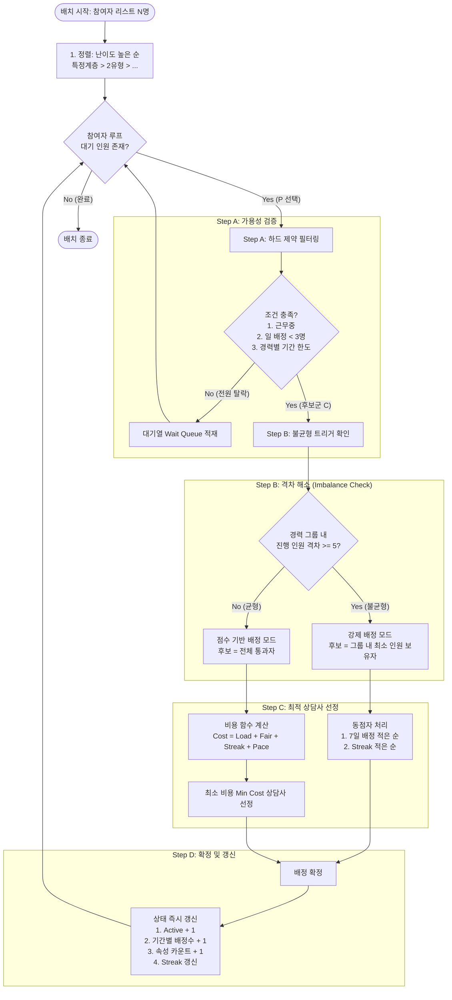

# 국취제 참여자 자동 배정 알고리즘 세부 로직 정의서 (v1.4)

## 1. 개요 및 목적

본 알고리즘은 국민취업지원제도 참여자를 상담사에게 배정함에 있어 **진행 인원 균형**을 최우선으로 하되, 참여자 속성의 **형평성**과 상담사의 **연간 업무 페이스**를 종합적으로 고려합니다.

- **핵심 목표:** 상담사 경력 그룹 내 진행 인원 편차 **±5명 이내** 유지
- **적용 방식:** 단계별 필터링(Hard Constraint) 후 비용 함수(Cost Function) 기반 최적화

## 2. 입력 데이터 정의

### 2.1. 상담사 (Counselor)

- **경력 그룹 (Tenure Group):**
    - **G1 (신입):** 경력 3개월 이하
    - **G2 (중급):** 경력 4개월 ~ 11개월
    - **G3 (고급):** 경력 12개월 이상
- **상태 변수:**
    - `active_case_count`: 현재 진행(상담) 중인 인원 수
    - `assigned_1d/7d/14d/30d`: 기간별 배정 누적 수
    - `assigned_ytd`: 연초 대비 누적 배정 수
    - `streak_count`: 동일 상담사 연속 배정 횟수

### 2.2. 참여자 (Participant)

- **속성:** 참여유형(1/2유형), 성별, 연령(청년/중장년), 경력유무, 학력, 특정계층여부, 진행단계, 출장상담사
- **난이도:** 특정계층, 희귀 속성 조합 등 상담 난이도에 따른 우선순위 정렬용

## 3. 핵심 배정 로직 (Logic Flow)

배정 요청 시 다음 단계(Step A ~ D)를 순차적으로 수행합니다.

### Step A. 후보군 생성 및 하드 제약 (Hard Constraints)

모든 상담사 중 아래 조건을 만족하는 인원만 후보(`candidate_all`)로 선정합니다.

1. **근무 가능 여부:** 부재가 아닐 것.(관리자가 직접 ON/OFF 지정)
2. **일일 한도 공통:** `금일 배정수(assigned_1d)` < **3명**
3. **경력별 기간 한도:** (아래 테이블 참조)

| **그룹** | **주 한도(7일)** | **2주 한도(14일)** | **월 한도(30일)** |
| --- | --- | --- | --- |
| **G1(신입)** | 3명 | 6명 | 12명 |
| **G2(중급)** | 5명 | 10명 | 14명 |
| **G3(고급)** | 8명 | 15명 | 15명 |

### Step B. 그룹별 불균형 강제 해소 (Imbalance Trigger)

경력 그룹별로 진행 인원(`active_case_count`)의 격차(`Max - Min`)를 확인합니다.

- **조건:** 특정 그룹 내 격차가 **5명 이상**인 경우
- **조치:** 해당 그룹 내에서 **진행 인원이 가장 적은(Min)** 상담사들만 `강제 배정 후보군(Forced Pool)`으로 선정합니다.
- *참여자 속성보다 인원 균형을 우선시하는 단계입니다.*

### Step C. 비용 함수 기반 최적화 (Scoring)

강제 배정 후보가 없을 경우, 전체 후보(`candidate_all`)를 대상으로 아래 비용 함수를 계산하여 **비용(Cost)이 가장 낮은 상담사**를 선택합니다.

$$
TotalCost = 0.45 \times C_{load} + 0.35 \times C_{fair} + 0.10 \times C_{streak} + 0.10 \times C_{pace}
$$

1. $C_{load}$ **(업무 부하 균형):** (내 진행인원 - 그룹 평균)$^2$
    - *동일 경력 그룹 내 평균보다 많이 맡고 있을수록 페널티*
2. $C_{fair}$ **(속성 형평성):** (해당 참여자와 동일 속성을 가진 내 보유 인원 수 / 내 전체 인원)
    - *이미 해당 유형을 많이 가지고 있을수록 페널티 (분산 유도)*
3. $C_{streak}$ **(연속 배정 방지):** (현재 연속 배정 횟수)$^2$
    - *한 사람에게 연속으로 배정되는 것을 방지*
4. $C_{pace}$ **(연간 페이싱):** (내 YTD 누적 - 그룹 YTD 평균)$^2$
    - *연간 목표치 대비 과속 방지*

### Step D. 동점자 처리 및 업데이트

1. 비용이 동일할 경우: `active_case_count` 적은 순 → `assigned_7d` 적은 순 → 랜덤
2. 배정 확정 시: 해당 상담사의 `active`, `rolling counts`, `streak` 등을 즉시 갱신

## 4. 배치 처리 전략 (Batch Processing)

고용센터에서 N명이 한 번에 배정될 경우:

1. **정렬(Sorting):** 참여자 리스트를 **난이도가 높은 순(예: 특정계층 > 2유형 > ...)**으로 정렬합니다.
2. **순차 배정:** 정렬된 순서대로 위 로직을 수행합니다.
    - *어려운 케이스를 먼저 균형 있게 배분하고, 쉬운 케이스로 남은 자리를 채우는 방식입니다.*
    - **동적 분산 (Dynamic Dispersion):** 배정마다 상담사 상태가 갱신되므로, **이미 해당 유형을 많이 가지고 있다면 다른 유형을 우선 배정(분산 유도)**하는 효과가 발생합니다.

## 5. 자동배정 로직
